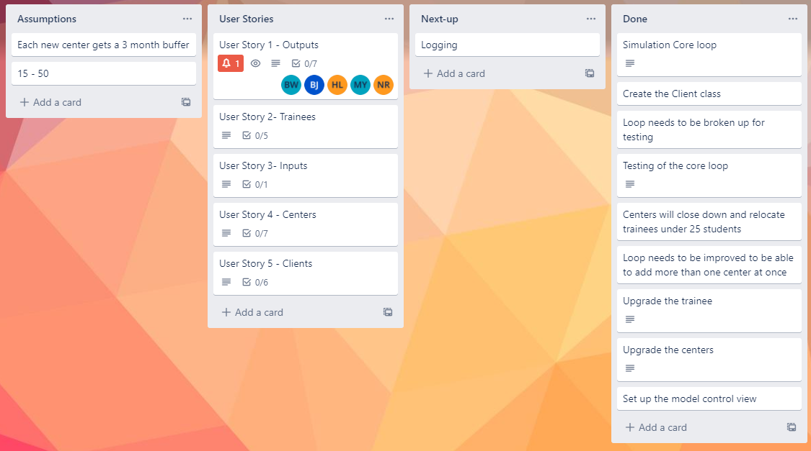

# Sparta Trainee Simulation

## How the project works

The simulation can take in a number of months, and randomly generate information on trainees, centres, and clients each month. Each month, it will generate trainees, and every two months it will generate training centres. The trainees graduate after 3 months and are placed on the bench. After a year of training, each month will have a 50% chance to generate a client with a requirement and random stream type. The client takes trainees from the bench and put them to work. If the clients get all the trainees they require in a year, they will return, otherwise they will leave unhappy.
At the end of the simulation, you will be able to see each month's information on centres, clients and trainees, or month by month if requested.

The project runs very quickly due to the parameter storage method. Care was taken to avoid creating an object for each trainee and to use various counting parameters instead. This removes the need for a database and will not encounter memory problems. It was tested to run up to 100,000 months and can do this in less than 2 minutes (depending on hardware).


## How to use the project
After running the simulation main, the user will have to input two choices. The first is the number of months you want the program to run for. There is no upper limit for the months (but only tested to 100,000). The second is to choose whether the results are displayed for each month simulated, or for just the final month. After that there is nothing else needed, just let the program run and you can see the results at the end. The random parameters can be modified in the source code if desired, and would allow for repeatable simulations but is beyond the scope of this project.

## Dependencies 
The following dependencies are required to run the project.
```
    <dependencies>
        <dependency>
            <groupId>org.junit.jupiter</groupId>
            <artifactId>junit-jupiter</artifactId>
            <version>5.8.2</version>
        </dependency>
        <dependency>
            <groupId>io.cucumber</groupId>
            <artifactId>cucumber-java</artifactId>
            <version>7.2.3</version>
        </dependency>

        <dependency>
            <groupId>io.cucumber</groupId>
            <artifactId>cucumber-junit</artifactId>
            <version>7.2.3</version>
        </dependency>
        <dependency>
            <groupId>org.apache.logging.log4j</groupId>
            <artifactId>log4j-core</artifactId>
            <version>2.17.1</version>
        </dependency>
    </dependencies>
```

## Project Team
Stephen - Scrum Master

Brandon - Lead Developer

Natasha - Developer

Harry - Developer/User Interface

Mehmet  - BDD Tester

Ben - JUnit Tester

## Sprints
### Sprint 1
The first sprint was making the core loop for the project. We created a Trello board to keep track of what we were working on and what was coming up and we started drafting a testing plan.
#### Sprint review
This sprint took longer than expected, and due to this, we had to adapt the future sprints around this. We were not happy with the rate of this sprint, but understanding the scale of the project made it difficult to know how to adapt.

### Sprint 2
The main core loop was created, but it was not ready to be tested, so refactoring took place for this sprint. During this stage, we set up an MVC model and started outputting the information to the console.
#### Sprint review
Due to sprint 1's progress, we chose a smaller sprint for sprint 2. This was difficult to get done, and not all of it was done in the end. This went better than the first sprint, but still room for improvement as we were still trying to understand how best to implement and test the different parts of the project model.
#### Sprint 3
Incorporating the new phase information from day 2 into the loop and refactoring were the main aims of this sprint. Testing began on the main core loop. The information given from day 3 began development but was not added to the main loop yet.
#### Sprint review
This sprint was much better, mostly focusing on the refactoring while one developer worked on creating the classes and methods for the new phase information. At this point, various issues were being solved, and progress on the project sped up considerably.

### Sprint 4
Adding in the phase information from day 3 into the main loop was the main part of the day, as well as testing it and improving testing on the previous information. This was the main sprint for cleaning up the code and making small improvements.
#### Sprint review
As sprint 3 went much better, sprint 4 also went well. The sprint did not contain a large number of tasks, and we got through them at a good pace. With one or two exceptions, this was just for cleaning up and felt much more relaxed because of this.
######
The trello board we completed for the week is shown below. It was used to track tasks and easily visualise requirements for each phase.
######

######


## Epics 
We create 4 different epics for each part of the project, that we then used to create user stories, and then made our acceptance criteria based on those stories.

The epics, user stories and acceptance criteria is shown below.
### Inputs
>As a user, I want to be able to input the number of months for the program to run.
##### Acceptance Criteria
>The program must be able to accept a number of months that will tell the program how long to run for.

### Trainees
>As a user, I want the system to generate trainees and train them in a course.
>
>As a user, I want trainees to have a waiting list once trained to move to clients
>
>As a user, if a center closes I want the trainees to be able to move to a new one

#### Acceptance Criteria
>Trainees are generated for each center
>
>Trainees are assigned and trained in one course
>
>Trainees are turned to trained after a year and moved to wait
>
>Trainees are moved to the client after a year
>
>Trainees are added to a waiting list if there is no place for them to go yet

### Centers
>I want a random center to be made every two months
>
>I want the center to take a number of trainees each month up to their capacity
>
>I want the center to be able to take trainees from the waiting list
>
>I want three different types of centers to be available with different specifications
>
>I want the center to close if the numbers are low

#### Acceptance Criteria
>A center is made every two months
>
>The center will be either a training hub, Bootcamp or tech center
> 
>Training hubs have a capacity of 100 and can open 3 at a time(max)
> 
>Bootcamp can train 500 and wait 3 months before closing to low attendance - only two can exist at a time
>
>The Tech center only teaches one course with 200 trainees. Chosen randomly.
>
>Center is closed if it goes below 25 users after the first month
>
>Center moves all its students to the waiting list if it closes

### Clients
As a user:
>I want Clients to start being generated after a year at a 50% chance
>
>I want the client to be looking for students with specific training.
>
>I want the client to be looking for at least 16 trainees
>
>I want the client to keep taking trainees until they hit their required amount
>
>I want the client to leave unhappy if they don't get them after a year
>
>I want the client to leave happy if they get their amount, and return the year after for more.

#### Acceptance Criteria
>Clients aren’t generated till after the first year
>
>Each month there is a 50% chance of being created
>
>Each client picks a random amount, starting at 16 trainees to take
>
>After a year they will stop taking and leave
>
>They should leave happy if they have enough students
>
>They should leave unhappy if they don’t reach their max

## Behavior-driven development

In this project, BDD approach was used to test the program in different scenarios. The cucumber tool and gherkin language were also implemented to be able to do this. There were several impediments in this testing due to the nature of the program. There are not many interactions in the program for user, and since BDD approach is more similar to black-box testing, the BDD testing completed in this project resembles white box testing. 

The BDD testing results on the waiting list and the training centre are shown below.
######


## JUnit testing

The model was tested extremely extensively JUnit to ensure the project criteria was satisfied.
 The images below shows the JUnit tests conducted and their resulting coverage of the model classes:
######

######

######

######
The coverage is generally very good for all classes and all tests passed, the model is confidently assumed to be working correctly due to these tests.

## Log4j
The project used Log4j to log the simulations progress. The logger outputs to a separate log file and contains different levels of logging. A typical log output for the simulation is shown below, with a "warn" included to highlight when it may occur.
######

######

## Typical output
Finally, a typical two-year simulation (24 months) is shown below. A breakdown for the centres, trainees and clients is included.
######

######
## Review
Overall we are happy with the outcome of the project. There are some improvements we would make some changes given the opportunity, but this would be mostly to our project process. Given more time, we would spend more time formally reviewing and going over each sprint, which would help us improve and streamline workflows in the future.

